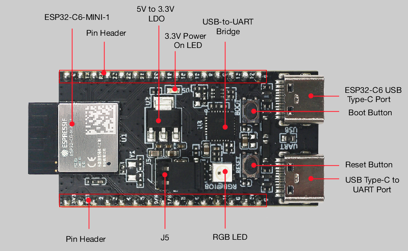

# esp32c6-rust-quickstart

This is a template repository to help you quickly get started with the RISC-V based ESP32-C6 series of MCUs from Espressif.

This template focuses specifically on the [ESP32-C6-DevKitM-1](https://docs.espressif.com/projects/esp-dev-kits/en/latest/esp32c6/esp32-c6-devkitm-1/user_guide.html), but can be easily adapted for other ESP32-C6 based development boards.

This template was initially generated using [esp-generate](https://github.com/esp-rs/esp-generate).

<!-- generator parameters: --chip esp32c6 -o esp32c6-mini-1 -o unstable-hal -o embassy -o stack-smashing-protection -o probe-rs -o defmt -o panic-rtt-target -o ci -o vscode -o zed -o stable-x86_64-unknown-linux-gnu-->

<center>
    
</center>

The ESP32-C6 SoC (System on Chip) supports Wi-Fi 6 in 2.4 GHz band, Bluetooth 5, Zigbee 3.0 and Thread 1.3.

It has two RISC-V cores: 1 high-performance (HP), and 1 low-power (LP). Both support the RV32IMAC instruction set.

## Overview

This template is built around a small set of crates that will help you handle most of the heavy lifting for any embedded project you plan to work on:

* [esp-hal](https://docs.espressif.com/projects/rust/esp-hal/1.1.1/esp32c6/esp_hal/index.html) is the `no_std` hardware abstraction layer for Espressif chips. It gives you safe access to peripherals such as GPIO, timers, SPI, and I2C.
* [embassy](https://embassy.dev/) provides the async runtime. The `embassy-executor` schedules async tasks and `embassy-time` supplies timers and delays, which lets you write concurrent firmware without an RTOS of your own. `esp-rtos` integrates Embassy with the ESP32-C6 timers.
* [defmt](https://github.com/knurling-rs/defmt) is a highly efficient logging framework. Rather than formatting strings on the device, it sends compact identifiers that are decoded on the host, keeping log statements cheap in both flash and CPU time. Logs are transported over RTT by `rtt-target` and `panic-rtt-target` routes panic messages through the same channel.
* [probe-rs](https://probe.rs/) is an embedded debugging and target interaction toolkit. It programs and debugs the microcontroller over a debug probe and is what `cargo run` invokes to flash the board and stream `defmt` logs back.
* [esp-bootloader-esp-idf](https://docs.rs/esp-bootloader-esp-idf) generates the app descriptor expected by the ESP-IDF second-stage bootloader so the firmware image boots correctly.

For inspiration and code examples, take a look at: [esp-hal examples](https://github.com/esp-rs/esp-hal/tree/main/examples)

## Getting started

First install Rust using [rustup](https://rustup.rs/). The toolchain channel and the compiler components are pinned in `rust-toolchain.toml`, so once `rustup` is present it will fetch the correct nightly toolchain, the `rust-src` component, and the `riscv32imac-unknown-none-elf` target automatically the first time you build. If you would rather add the target by hand, run:

```sh
rustup target add riscv32imac-unknown-none-elf
```

Then install [probe-rs](https://probe.rs/docs/getting-started/installation/), the tool used to flash the board and stream logs. On Linux you also need the udev rules described in the probe-rs documentation so that your user can access the probe without root.

Connect the ESP32-C6-DevKitM-1 to your machine over the USB port labelled for the built-in USB-JTAG interface. No external debug probe is required because the ESP32-C6 exposes a USB-JTAG bridge on chip.

## Compiling

Build the firmware with Cargo. The target and linker arguments are all configured in `.cargo/config.toml`, so a plain build is enough:

```sh
cargo build           # debug profile
cargo build --release # optimized profile
```

The `DEFMT_LOG` environment variable in `.cargo/config.toml` controls the log level compiled into the binary. It defaults to `info`; set it to `debug` or `trace` for more verbose output.

## Flashing

The Cargo runner in `.cargo/config.toml` is set to `probe-rs run`, so flashing and running are a single command. With the board connected, run:

```sh
cargo run             # flash and run the debug build
cargo run --release   # flash and run the release build
```

This programs the chip, resets it, and then streams `defmt` logs (including panic backtraces) from the device back to your terminal. You should see the `Hello, RISC-V Ottawa!` messages printed once per second from `src/bin/main.rs`.

## Resources

* Development board-specific resources
  - [ESP32-C6-DevKitM-1 user guide](https://docs.espressif.com/projects/esp-dev-kits/en/latest/esp32c6/esp32-c6-devkitm-1/user_guide.html)
  - [ESP32-C6 Datasheet](https://www.espressif.com/sites/default/files/documentation/esp32-c6_datasheet_en.pdf)
  - [ESP32-C6-MINI-1 Datasheet](https://www.espressif.com/sites/default/files/documentation/esp32-c6-mini-1_datasheet_en.pdf)
  - [ESP32-C6-DevKitM-1 Schematic](https://dl.espressif.com/dl/schematics/esp32-c6-devkitm-1-schematics.pdf)
* [The Rust on ESP Book](https://docs.espressif.com/projects/rust/book)
* [Embedded Rust (no_std) on Espressif](https://docs.espressif.com/projects/rust/no_std-training/)
* [The Embedded Rust Book](https://rust-embedded.github.io/book/)
* [Embassy Book](https://embassy.dev/book/)
* [defmt Book](https://defmt.ferrous-systems.com/)
* [esp-rs Documentation and Resources](https://docs.espressif.com/projects/rust/)
* [esp-hal for the ESP32-C6](https://docs.espressif.com/projects/rust/esp-hal/1.1.1/esp32c6/esp_hal/index.html)
* [probe-rs](https://probe.rs/)
* [defmt](https://github.com/knurling-rs/defmt)
* [Awesome Embedded Rust](https://github.com/rust-embedded/awesome-embedded-rust)
